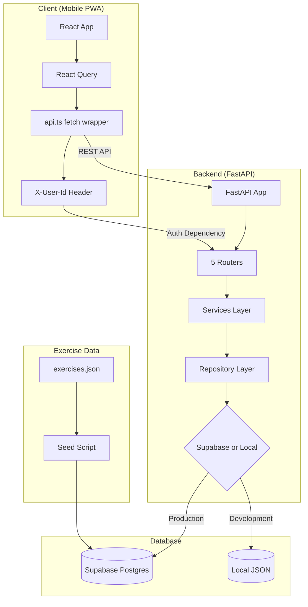
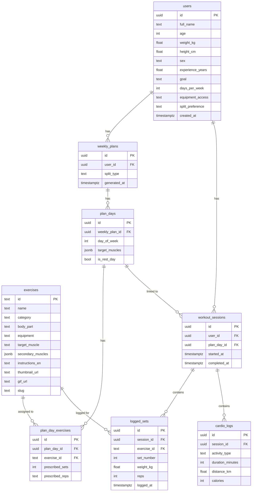
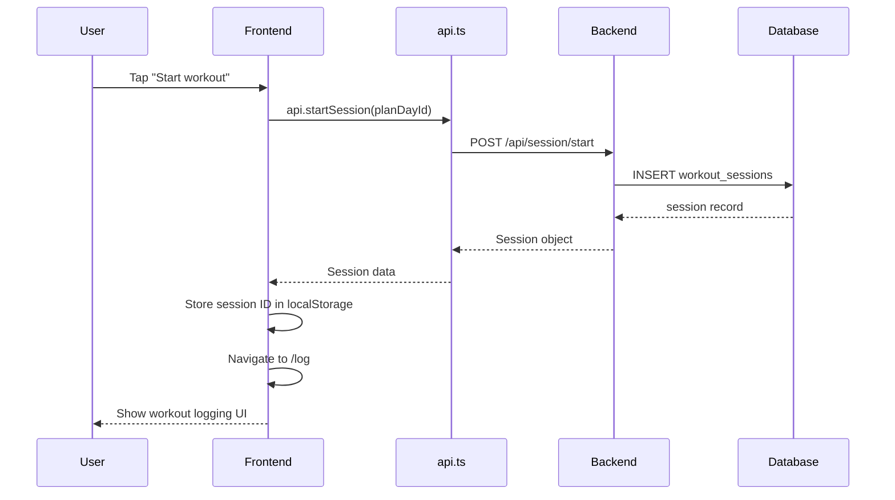
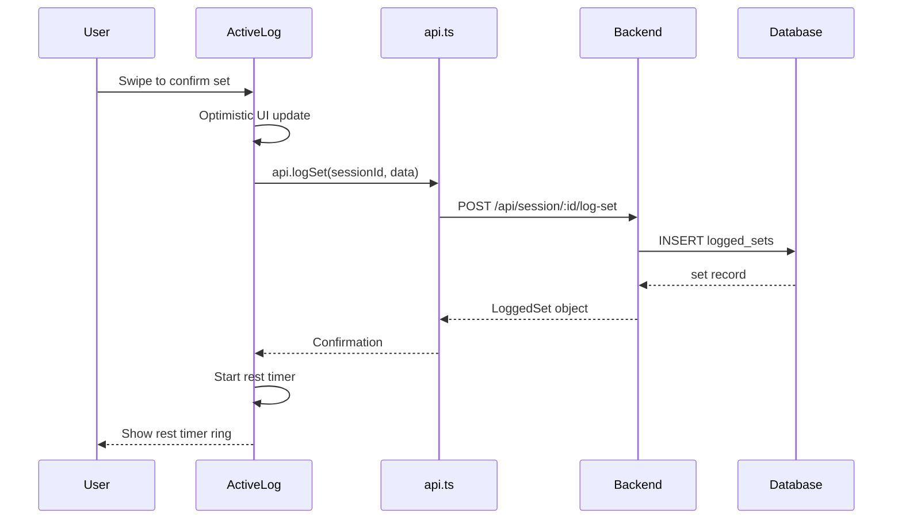
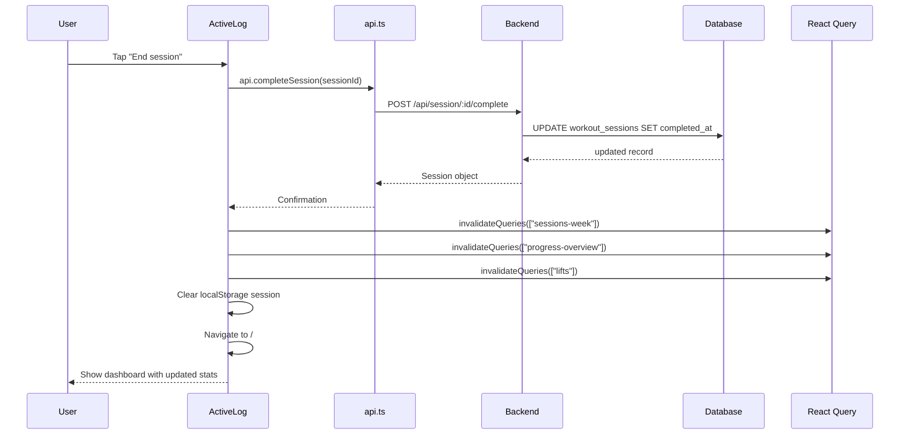
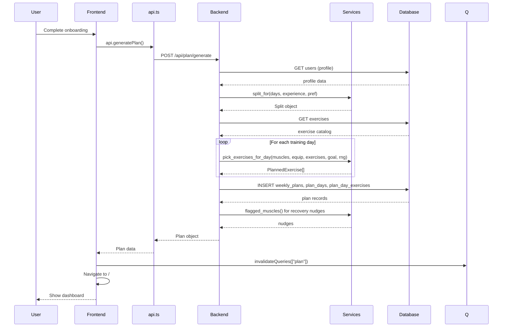
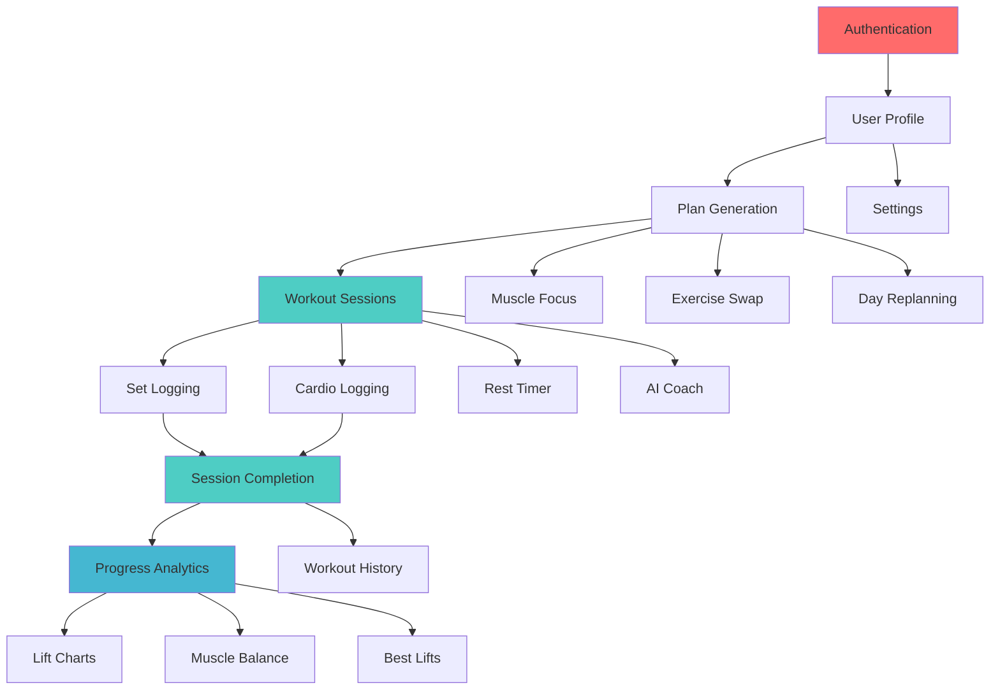

# RepPlan — Complete Technical Documentation

**Version:** 1.0  
**Generated:** 2026-08-14  
**Status:** Authoritative source of truth for the RepPlan codebase

---

## Table of Contents

1. [Executive Summary](#1-executive-summary)
2. [Project Overview](#2-project-overview)
3. [Architecture Overview](#3-architecture-overview)
4. [Technology Stack](#4-technology-stack)
5. [Repository Structure](#5-repository-structure)
6. [Complete Feature Inventory](#6-complete-feature-inventory)
7. [Workout System](#7-workout-system)
8. [Exercise System](#8-exercise-system)
9. [Workout Session UX](#9-workout-session-ux)
10. [Dashboard](#10-dashboard)
11. [Progress & Analytics](#11-progress--analytics)
12. [UI/UX Design System](#12-uiux-design-system)
13. [Mobile & Gym UX Audit](#13-mobile--gym-ux-audit)
14. [Frontend Architecture](#14-frontend-architecture)
15. [Backend Architecture](#15-backend-architecture)
16. [Database Architecture](#16-database-architecture)
17. [Authentication & User Management](#17-authentication--user-management)
18. [State Management](#18-state-management)
19. [Algorithms & Calculations](#19-algorithms--calculations)
20. [API & Data Flow](#20-api--data-flow)
21. [Performance Analysis](#21-performance-analysis)
22. [Error Handling](#22-error-handling)
23. [Security Audit](#23-security-audit)
24. [Accessibility Audit](#24-accessibility-audit)
25. [PWA / Offline Capabilities](#25-pwa--offline-capabilities)
26. [Third-Party Dependencies](#26-third-party-dependencies)
27. [File-by-File Architecture Map](#27-file-by-file-architecture-map)
28. [Technical Debt](#28-technical-debt)
29. [Missing Features](#29-missing-features)
30. [Product Differentiation](#30-product-differentiation)
31. [Recommended Future Architecture](#31-recommended-future-architecture)
32. [Development Roadmap](#32-development-roadmap)
33. [Development Backlog](#33-development-backlog)
34. [Testing Strategy](#34-testing-strategy)
35. [Deployment](#35-deployment)
36. [Developer Guide](#36-developer-guide)
37. [How to Continue Development](#37-how-to-continue-development)
38. [Feature Dependency Graph](#38-feature-dependency-graph)
39. [Product Quality Score](#39-product-quality-score)
40. [Final State of RepPlan](#40-final-state-of-repplan)

---

## 1. Executive Summary

### What RepPlan Is

RepPlan is a mobile-first Progressive Web App (PWA) for gym training. It combines a workout split planner with an in-gym session logger and progress tracker. The tagline is "Discipline made visible."

### Problem It Solves

Gym-goers need a system to plan their weekly training splits, execute workouts with fast set logging during sessions, and track progressive overload over time. Most fitness apps are either too complex (bodybuilding platforms) or too simple (basic timers). RepPlan aims for a premium, focused experience.

### Target Users

Intermediate gym-goers (1-4 years experience) who follow structured training programs and want fast, friction-free workout logging with visual progress feedback.

### Core Capabilities

1. **Split Planning:** Algorithmically generates weekly workout splits based on experience, equipment, and training frequency
2. **Workout Logging:** In-session interface for logging weight, reps, and cardio with a rest timer
3. **Progress Tracking:** Charts, statistics, personal records, and muscle balance analysis
4. **AI Coach:** Client-side fitness chatbot with comprehensive knowledge base (50+ topics)
5. **Calendar Heatmap:** Visual workout history with monthly navigation

### Technology Stack

| Layer | Technology |
|-------|-----------|
| Frontend | React 18 + TypeScript + Vite 5 |
| Styling | Tailwind CSS 3.4 with custom glassmorphism design system |
| Server State | TanStack React Query v5 |
| Routing | React Router DOM v6 |
| Charts | Recharts v2 |
| PWA | vite-plugin-pwa v0.20 |
| Backend | FastAPI (Python 3.12) |
| Database | Supabase (PostgreSQL) |
| Auth | Header-based (`X-User-Id`), no JWT |

### Architecture Style

Client-server with a thin REST API backend. No server-side rendering. The frontend is a standalone PWA; the backend is a stateless API service. Repository pattern with Protocol-based abstraction allows local development without Supabase.

### Current Maturity Level

**Functional prototype.** Core workflows work end-to-end: onboarding → plan generation → workout logging → progress tracking. The UI is polished with a consistent glassmorphism design system. However, it lacks testing infrastructure, CI/CD, real authentication, and offline support.

### What Makes It Different

- **Premium glassmorphism UI** on a pure black/white/charcoal palette — visually distinct from typical fitness apps
- **Gym-first UX:** Swipe-to-confirm set logging, large touch targets, dark theme for gym environments
- **Deterministic plan generation:** Seeded RNG produces reproducible plans per user
- **Client-side AI coach:** 1301-line fitness knowledge base with smart matching (no API dependency)
- **Code-split PWA:** Lazy-loaded screens, manual chunks, installable with app shortcuts

### Current Strengths

1. Polished, consistent visual design across all screens
2. Fast workout logging with swipe gestures and number keypad
3. Clean separation of concerns (backend services, repo pattern)
4. Deterministic, reproducible plan generation
5. Comprehensive test suite for backend business logic
6. PWA-ready with installability

### Current Weaknesses

1. No real authentication (UUID header can be spoofed)
2. No offline support (PWA configured but no service worker caching strategy)
3. No CI/CD pipeline
4. `ActiveLog.tsx` is a 709-line god component
5. No frontend tests whatsoever
6. AI coach is client-side keyword matching, not real AI
7. No database migration files (schema managed outside repo)
8. Committed `.env` files with real secrets

### Most Important Opportunities

1. Implement proper Supabase Auth (JWT-based)
2. Add offline-first workout logging
3. Split `ActiveLog.tsx` into composable modules
4. Add frontend tests
5. Set up CI/CD pipeline
6. Integrate a real AI provider for the coach

---

## 2. Project Overview

### Purpose

RepPlan is designed to be a complete workout management tool that handles the full lifecycle: planning training splits → executing workouts → tracking progress → adjusting plans.

### Main Capabilities (Detailed)

| Capability | Description |
|------------|-------------|
| **Onboarding** | Collects user profile (age, weight, height, experience, goals, equipment) |
| **Plan Generation** | Algorithmically creates weekly split based on profile |
| **Day Detail** | Shows exercises for a specific day with swap/regenerate options |
| **Muscle Focus** | Ad-hoc "train a muscle" mode outside the plan |
| **Workout Logging** | Active session with set logging, cardio, rest timer |
| **Session Persistence** | Active session survives page refresh via localStorage |
| **Progress Dashboard** | Streak, volume, weekly rhythm, best lifts, muscle balance |
| **Lift Charts** | Per-exercise weight/volume area charts |
| **Workout History** | Calendar heatmap with monthly navigation |
| **AI Coach** | Chatbot with fitness knowledge base |
| **Settings** | Profile editing, app reset |
| **Recovery Nudges** | Flags recently-trained muscles |
| **PWA** | Installable, fullscreen, app shortcuts |

### What It Is NOT

- Not a social platform (no sharing, no community)
- Not a nutrition tracker (no food logging, no calorie counting)
- Not a wearable integration (no Apple Watch, no heart rate)
- Not a real AI (no LLM integration, no API-based chatbot)
- Not offline-first (requires network for API calls)

---

## 3. Architecture Overview

### High-Level Architecture



### Communication Flow

1. Frontend makes REST calls via `api.ts` with `X-User-Id` header
2. FastAPI extracts user ID via `Depends(get_current_user_id)`
3. Router calls service layer for business logic
4. Service calls repository for data access
5. Repository queries Supabase or local JSON store
6. Response flows back through the same layers

### Key Design Decisions

1. **No SSR:** Pure SPA with client-side routing
2. **Stateless backend:** No session state on server; all state in database
3. **Repository pattern:** Protocol-based abstraction enables local development
4. **Deterministic plan generation:** Seeded RNG for reproducibility
5. **Client-side AI:** Offline-capable fitness knowledge base

---

## 4. Technology Stack

### Frontend Dependencies

| Package | Version | Purpose | Critical? |
|---------|---------|---------|-----------|
| `react` | ^18.3.1 | UI library | Yes |
| `react-dom` | ^18.3.1 | DOM rendering | Yes |
| `react-router-dom` | ^6.26.0 | Client-side routing | Yes |
| `@tanstack/react-query` | ^5.59.0 | Server state management | Yes |
| `recharts` | ^2.13.0 | Charting (area charts) | Medium |
| `@supabase/supabase-js` | ^2.45.0 | Supabase client (**unused**) | No |

### Frontend Dev Dependencies

| Package | Version | Purpose |
|---------|---------|---------|
| `typescript` | ^5.6.2 | Type checking |
| `vite` | ^5.4.8 | Build tool & dev server |
| `@vitejs/plugin-react` | ^4.3.2 | React fast-refresh |
| `vite-plugin-pwa` | ^0.20.5 | PWA manifest & SW |
| `tailwindcss` | ^3.4.13 | Utility-first CSS |
| `postcss` | ^8.4.47 | CSS processing |
| `autoprefixer` | ^10.4.20 | Vendor prefixing |

### Backend Dependencies

| Package | Version | Purpose |
|---------|---------|---------|
| `fastapi` | >=0.115.0 | ASGI web framework |
| `uvicorn[standard]` | >=0.30.0 | ASGI server |
| `supabase` | >=2.6.0 | Supabase Python client |
| `pydantic` | >=2.8.0 | Data validation |
| `pydantic-settings` | >=2.4.0 | Environment config |
| `httpx` | >=0.27.0 | HTTP client (exercise dataset fetch) |
| `python-dotenv` | >=1.0.1 | .env loading |
| `pytest` | >=8.3.0 | Test framework |

---

## 5. Repository Structure

```
/home/sriragul/RepPlan/
├── README.md                          # Single documentation file (20 lines)
├── .gitignore                         # 41 lines, covers .env, __pycache__, dist, etc.
├── backend/
│   ├── .env                           # Secrets (gitignored but on disk)
│   ├── .venv/                         # Python 3.12 virtual environment
│   ├── requirements.txt               # 8 dependencies
│   ├── app/
│   │   ├── main.py                    # FastAPI entry point (16 lines)
│   │   ├── db.py                      # Supabase client singleton (15 lines)
│   │   ├── repo.py                    # Repository pattern (637 lines) ← LARGEST BACKEND FILE
│   │   ├── deps.py                    # Auth dependencies (27 lines)
│   │   ├── config/settings.py         # Pydantic settings (12 lines)
│   │   ├── schemas/models.py          # Pydantic models (131 lines)
│   │   ├── routers/
│   │   │   ├── profile.py             # Profile CRUD (25 lines)
│   │   │   ├── plan.py                # Plan generation (153 lines)
│   │   │   ├── exercises.py           # Exercise search/swap (39 lines)
│   │   │   ├── session.py             # Session lifecycle (78 lines)
│   │   │   └── progress.py            # Progress tracking (47 lines)
│   │   └── services/
│   │       ├── split.py               # Split generation (231 lines)
│   │       ├── planner.py             # Exercise selection (190 lines)
│   │       ├── recovery.py            # Recovery heuristic (40 lines)
│   │       └── exercise_data.py       # Data transformation (136 lines)
│   ├── data/exercises.json            # Exercise seed dataset
│   ├── seed/seed_exercises.py         # DB seed script (64 lines)
│   └── tests/                         # 25 test functions across 6 files
├── frontend/
│   ├── .env                           # Supabase anon key
│   ├── package.json                   # 6 runtime + 9 dev dependencies
│   ├── index.html                     # PWA meta tags, font preloads
│   ├── vite.config.ts                 # Vite + PWA + dev proxy to :8100
│   ├── tailwind.config.js             # Custom theme (110 lines)
│   ├── postcss.config.js
│   ├── tsconfig.json / tsconfig.node.json
│   ├── dist/                          # Build output
│   ├── public/
│   │   ├── fonts/                     # 8 custom font files
│   │   └── icons/                     # 4 PWA icon sizes
│   └── src/
│       ├── main.tsx                   # React root + QueryClient setup
│       ├── App.tsx                    # Router + lazy imports + auth gate
│       ├── index.css                  # Glassmorphism design system (313 lines)
│       ├── hooks/                     # EMPTY directory
│       ├── lib/
│       │   ├── api.ts                 # API client (94 lines)
│       │   ├── types.ts               # TypeScript types (111 lines)
│       │   ├── user.ts                # UUID generation (10 lines)
│       │   ├── constants.ts           # Shared constants (7 lines)
│       │   ├── supabase.ts            # UNUSED Supabase client (6 lines)
│       │   ├── chatbot.ts             # Chat engine (169 lines)
│       │   └── fitness-knowledge.ts   # Knowledge base (1301 lines) ← LARGEST FILE
│       ├── components/
│       │   ├── BottomNav.tsx           # 5-tab mobile nav (55 lines)
│       │   ├── Sidebar.tsx            # Desktop sidebar (62 lines)
│       │   ├── Shell.tsx              # Layout wrapper (23 lines)
│       │   ├── GlassCard.tsx          # Glass card (18 lines)
│       │   ├── Button.tsx             # Button variants (23 lines)
│       │   ├── Stepper.tsx            # +/- number input (72 lines)
│       │   ├── NumberKeypad.tsx        # Inline numpad (57 lines)
│       │   ├── SwipeRow.tsx           # Swipe-to-confirm (67 lines)
│       │   ├── RestTimer.tsx          # Countdown timer (66 lines)
│       │   ├── DisciplineRing.tsx     # SVG progress ring (67 lines)
│       │   ├── CalendarHeatmap.tsx    # Heatmap calendar (132 lines)
│       │   ├── SegmentedControl.tsx   # iOS segmented (39 lines)
│       │   ├── BottomSheet.tsx        # Modal sheet (23 lines)
│       │   ├── Skeleton.tsx           # Loading skeletons (62 lines)
│       │   ├── ExerciseImage.tsx      # Image with zoom (95 lines)
│       │   ├── ErrorBoundary.tsx      # Error boundary (63 lines)
│       │   └── icons.tsx             # 17 icon components (217 lines)
│       └── screens/
│           ├── Home.tsx              # Dashboard (293 lines)
│           ├── Plan.tsx              # Weekly plan (208 lines)
│           ├── DayDetail.tsx         # Day detail (162 lines)
│           ├── ActiveLog.tsx         # Workout logging (709 lines) ← LARGEST COMPONENT
│           ├── Progress.tsx          # Statistics (314 lines)
│           ├── WorkoutHistory.tsx    # Calendar view (350 lines)
│           ├── Coach.tsx             # AI chatbot (280 lines)
│           ├── Onboarding.tsx        # First-time setup (192 lines)
│           └── Settings.tsx          # Profile editing (276 lines)
└── supabase/                          # EMPTY (no migrations)
```

### File Size Summary

| Category | Files | Total Lines |
|----------|-------|-------------|
| Frontend screens | 9 | ~2,884 |
| Frontend components | 17 | ~1,021 |
| Frontend lib | 7 | ~1,797 |
| Frontend config | 5 | ~197 |
| Backend app | 12 | ~1,373 |
| Backend tests | 6 | ~469 |
| Backend services | 4 | ~597 |
| **Total** | **~60** | **~8,338** |

---

## 6. Complete Feature Inventory

### Feature 1: Onboarding

**Purpose:** First-time user setup to collect profile data needed for plan generation.

**User Flow:**
```
App launch → Auth gate detects no profile → Redirect to /onboarding
→ Enter name → Set age → Set weight → Set height → Select sex
→ Set experience years → Select goal → Select days/week → Select equipment
→ Tap "Build my plan" → Profile saved → Plan generated → Navigate to /
```

**UI:**
- Single scrollable form in `Onboarding.tsx`
- `Stepper` components for numeric inputs (age, weight, height, experience)
- `SegmentedControl` for categorical inputs (sex, goal, days, equipment)
- Validation: name is required (shows error), other fields have sensible defaults
- Loading state during profile save + plan generation

**Logic:**
- Profile is saved via `api.saveProfile()` (POST `/api/profile`)
- Plan is generated via `api.generatePlan()` (POST `/api/plan/generate`)
- On success, navigates to `/`
- On error, displays error message from API

**Data:**
- Input: `ProfileInput` (name, age, weight, height, sex, experience, goal, days_per_week, equipment)
- Output: `Profile` + `Plan` objects stored in Supabase

**Files:**
- `src/screens/Onboarding.tsx` (192 lines)
- `src/lib/api.ts` — `saveProfile()`, `generatePlan()`
- `backend/app/routers/profile.py` — `create_or_update_profile()`
- `backend/app/routers/plan.py` — `generate_plan()`
- `backend/app/schemas/models.py` — `ProfileIn`, `ProfileOut`

**Dependencies:**
- React Query mutations
- Supabase database

**Edge Cases:**
- Refresh during onboarding: Auth gate re-checks profile, may redirect back
- Network failure: Error displayed, user can retry
- Duplicate profile: Upsert behavior (POST replaces existing)

**Improvement Opportunities:**
- Add progress indicator (step 1/6)
- Add skip option for quick start
- Validate age/weight ranges client-side

---

### Feature 2: Plan Generation

**Purpose:** Algorithmically creates a weekly training split based on user profile.

**User Flow:**
```
POST /api/plan/generate → Backend fetches profile
→ Determines split type (Full Body / Upper-Lower / PPL)
→ Loads exercise catalog
→ For each training day: selects 4-6 exercises via round-robin
→ Persists plan to database
→ Returns plan with recovery nudges
```

**UI:**
- Visible on Home screen (today's session, "Coming up" section)
- Full plan on Plan screen (7-day overview)
- Day detail on DayDetail screen (exercises list)

**Logic (Backend):**
1. `split_for(days_per_week, experience_years, split_preference)` determines split type
2. `pick_exercises_for_day(muscles, equipment, exercises, goal, rng)` selects exercises
3. `flagged_muscles()` attaches recovery nudges
4. Seeded RNG (`f"{user_id}:{split_type}"`) ensures deterministic results

**Split Matrix:**

| Days/Week | Experience | Split |
|-----------|-----------|-------|
| 2-3 | Any | Full Body |
| 4 | < 3.5 years | Upper / Lower |
| 4 | >= 3.5 years | Push / Pull / Legs + 1 |
| 5 | Any | Push / Pull / Legs + 2 |
| 6 | >= 3.5 years | Push / Pull / Legs x2 |
| 6 | < 3.5 years | Push / Pull / Legs x2 |

**Files:**
- `backend/app/services/split.py` (231 lines)
- `backend/app/services/planner.py` (190 lines)
- `backend/app/routers/plan.py` (153 lines)
- `src/screens/Plan.tsx` (208 lines)
- `src/screens/DayDetail.tsx` (162 lines)

---

### Feature 3: Workout Logging (Active Session)

**Purpose:** In-gym interface for logging resistance sets and cardio during a workout.

**User Flow:**
```
Home → "Start workout" → /log
→ Session initialized (or resumed from localStorage)
→ Progress bar shows sets logged / prescribed
→ Tap exercise → BottomSheet opens
→ Enter weight + reps → Swipe to log set → Rest timer starts
→ Repeat for all sets
→ Optional: Add cardio
→ "End session" → Session completed → Progress updated
```

**UI:**
- `ActiveLog.tsx` (709 lines) — the largest component
- Progress bar with set completion ratio
- Exercise cards with thumbnails, set/rep info, dot indicators
- `BottomSheet` with `SetSheet` for detailed set logging
- `Stepper` for weight/reps with `NumberKeypad` for direct input
- `SwipeRow` for swipe-to-confirm gesture
- `RestTimer` with `DisciplineRing` visualization
- `CardioSheet` for cardio logging

**Logic:**
- Session created via `api.startSession(planDayId)`
- Sets logged via `api.logSet(sessionId, data)`
- Cardio logged via `api.logCardio(sessionId, data)`
- Session completed via `api.completeSession(sessionId)`
- Active session ID persisted in localStorage (`repplan_active_session`)
- Default weight suggestions based on bodyweight and exercise type

**Rest Timer Logic:**
- Compound exercises (detected by `COMPOUND_RE` regex): 150 seconds
- Isolation exercises (abs, calves, forearms): 60 seconds
- Default: 90 seconds

**Weight Default Logic:**
- Bodyweight exercises: 0
- First time: estimated from bodyweight × multiplier
- Subsequent: last used weight for that exercise

**Data:**
- Input: `LogSetIn` (exercise_id, set_number, weight_kg, reps)
- Input: `LogCardioIn` (activity_type, duration_minutes, distance_km, calories)
- Output: `LoggedSet`, `CardioLog` objects
- localStorage: active session ID, last used weight

**Files:**
- `src/screens/ActiveLog.tsx` (709 lines)
- `src/components/SwipeRow.tsx` (67 lines)
- `src/components/Stepper.tsx` (72 lines)
- `src/components/NumberKeypad.tsx` (57 lines)
- `src/components/RestTimer.tsx` (66 lines)
- `src/components/DisciplineRing.tsx` (67 lines)
- `backend/app/routers/session.py` (78 lines)

**Edge Cases:**
- Page refresh mid-workout: Session ID in localStorage allows resumption
- No plan day (muscle focus mode): Session created without plan_day_id
- Network failure during set logging: Error state with retry button
- Duplicate sets: Backend allows (set_number can repeat)

---

### Feature 4: Progress Tracking

**Purpose:** Visualize workout history, strength progression, and muscle balance.

**User Flow:**
```
Progress screen → View streak badge → View 3-stat grid
→ View weekly rhythm chart → Select exercise → View lift chart
→ Toggle weight/volume → View best lifts table → View recent workouts
```

**UI:**
- `Progress.tsx` (314 lines)
- Streak badge (weeks)
- 3-stat grid: total workouts, total sets, total volume
- Weekly rhythm: horizontal bar chart (Recharts)
- Lift progress: exercise selector pills + area chart
- Best lifts table
- Recent workouts list
- Volume this week: horizontal bar per muscle group

**Data Sources:**
- `api.progressOverview()` → `ProgressOverview`
- `api.muscleBalance()` → `MuscleBalance[]`
- `api.loggedLifts()` → exercise list with set counts
- `api.progressForExercise(id)` → `LiftPoint[]` time series

**Charts:**
- Weekly rhythm: Recharts `BarChart` with custom styling
- Lift progress: Recharts `AreaChart` with gradient fill
- X-axis: dates, Y-axis: weight_kg or volume

**Files:**
- `src/screens/Progress.tsx` (314 lines)
- `backend/app/routers/progress.py` (47 lines)
- `backend/app/repo.py` — `_build_overview()`, `progress_for_exercise()`

---

### Feature 5: Workout History Calendar

**Purpose:** Visual calendar view of past workout sessions.

**User Flow:**
```
ActiveLog header → Calendar icon → /history
→ Monthly calendar with heatmap → Navigate months
→ Tap date → View session details → See exercises, sets, volume
```

**UI:**
- `WorkoutHistory.tsx` (350 lines)
- `CalendarHeatmap.tsx` (132 lines)
- Month navigation (prev/next/today)
- Monthly stats summary
- 5-level heat coloring (none → light → moderate → active → intense)
- Day detail panel with exercise breakdown
- Session cards with up to 4 exercises shown

**Heat Levels:**
- 0: No workouts (dark)
- 1: 1-3 sets (light)
- 2: 4-7 sets (moderate)
- 3: 8-12 sets (active)
- 4: 13+ sets (intense)

**Files:**
- `src/screens/WorkoutHistory.tsx` (350 lines)
- `src/components/CalendarHeatmap.tsx` (132 lines)
- `src/lib/api.ts` — `workoutHistory()`, `sessionDetail()`

---

### Feature 6: AI Coach

**Purpose:** Client-side fitness chatbot for exercise and nutrition guidance.

**User Flow:**
```
Coach screen → View daily insight → View quick analysis options
→ Type question or tap suggestion → AI responds
→ Non-fitness questions get polite refusal
```

**UI:**
- `Coach.tsx` (280 lines)
- Empty state: animated AI orb, daily insight, quick analysis buttons, popular questions
- Chat interface: user messages (right), AI messages (left), typing indicator
- Input bar with send button

**Logic:**
- `getFitnessResponse(input)` matches against 36 fitness topics
- Keyword + regex matching with confidence scoring
- Greeting detection with contextual responses
- Non-fitness question refusal (polite redirection)
- Simulated typing delay (800-1400ms)

**Knowledge Base:**
- `fitness-knowledge.ts` (1301 lines) — 36 topics covering exercises, nutrition, supplements, recovery, training concepts, diets

**Files:**
- `src/screens/Coach.tsx` (280 lines)
- `src/lib/chatbot.ts` (169 lines)
- `src/lib/fitness-knowledge.ts` (1301 lines)

---

### Feature 7: Settings

**Purpose:** Profile editing and app management.

**User Flow:**
```
Settings screen → Edit name, goal, equipment, days
→ Save button appears on change → Save → Profile updated
→ Reset button → Confirm → Clear localStorage → Redirect to onboarding
```

**UI:**
- `Settings.tsx` (276 lines)
- iOS-style grouped list sections
- Name input field
- Goal, equipment, days selectors (SegmentedControl)
- Save button (appears only on changes)
- Reset button with confirmation
- About section with license note

**Files:**
- `src/screens/Settings.tsx` (276 lines)
- `src/lib/api.ts` — `saveProfile()`

---

### Feature 8: Muscle Focus

**Purpose:** Ad-hoc training session for a specific muscle group outside the plan.

**User Flow:**
```
Plan screen → "Train a muscle" → Select muscle from grid
→ Exercises fetched → Navigate to /log?muscle=X → Log workout
```

**UI:**
- Plan screen muscle grid (3 columns, 12 muscles)
- Each muscle button navigates to `/log?muscle={muscle}`

**Logic:**
- `api.muscleFocus(muscle, equipment, goal)` returns exercise list
- ActiveLog detects `muscle` query param and creates session accordingly

**Files:**
- `src/screens/Plan.tsx` (208 lines)
- `src/screens/ActiveLog.tsx` — muscle focus detection
- `backend/app/routers/plan.py` — `muscle_focus()`

---

### Feature 9: Exercise Swap

**Purpose:** Replace an exercise in the plan with a compatible alternative.

**User Flow:**
```
DayDetail → Tap swap icon on exercise → API call
→ New exercise returned → Plan updated optimistically
```

**Logic:**
- `api.swapExercise(exerciseId, equipment)` finds a substitute
- Same target muscle, different exercise, equipment-compatible
- Optimistic UI update via `queryClient.setQueryData`

**Files:**
- `src/screens/DayDetail.tsx` (162 lines)
- `backend/app/routers/exercises.py` — `swap_exercise()`
- `backend/app/services/planner.py` — `find_swap()`

---

### Feature 10: Day Replanning

**Purpose:** Redistribute a skipped day's muscles to remaining training days.

**User Flow:**
```
DayDetail → "Redistribute targets" → API call
→ Muscles spread to remaining days → Plan refreshed
```

**Logic:**
- `redistribute_day(day_muscles, remaining_days)` uses round-robin
- Skipped day becomes rest day
- Other days gain additional target muscles

**Files:**
- `src/screens/DayDetail.tsx`
- `backend/app/routers/plan.py` — `replan_skipped_day()`
- `backend/app/services/split.py` — `redistribute_day()`

---

### Feature 11: Recovery Nudges

**Purpose:** Flag muscles that were trained recently to prevent overtraining.

**Logic:**
- 48-hour lookback window
- Flag if muscle trained 2+ times in window
- Displayed as human-readable nudges on DayDetail

**Files:**
- `backend/app/services/recovery.py` (40 lines)
- `backend/app/routers/plan.py` — `_attach_recovery_nudges()`

---

### Feature 12: PWA

**Purpose:** Installable web app with native-like behavior.

**Configuration:**
- Manifest auto-generated by vite-plugin-pwa
- Icons: 32, 180, 192, 512px
- Shortcuts: "Start a workout" → `/log`, "View plan" → `/plan`
- Apple touch icon support
- `display: standalone`, `theme_color: #0C0B08`

**Files:**
- `frontend/vite.config.ts` — PWA configuration
- `frontend/public/icons/` — icon assets
- `frontend/index.html` — meta tags

---

## 7. Workout System — Deep Analysis

### Workout Creation

Workouts are not directly created by users. Instead:
1. User completes onboarding → profile saved
2. `POST /api/plan/generate` triggers plan creation
3. Plan contains 7 days, each with 4-6 exercises
4. User starts a workout by tapping "Start workout" or selecting a day

### Workout Templates

RepPlan does NOT have explicit templates. The plan IS the template — each day defines prescribed exercises, sets, and reps. However:
- Users can regenerate plans (new generation replaces old)
- Users can swap individual exercises
- Users can redistribute muscles across days
- Users can do "muscle focus" sessions outside the plan

### Workout Plans

**Plan structure (from `types.ts`):**
```typescript
type Plan = {
  id: string;
  user_id: string;
  split_type: string;       // e.g., "Push / Pull / Legs x2"
  generated_at: string;
  days: PlanDay[];
};

type PlanDay = {
  id: string;
  day_of_week: number;      // 1-7 (Mon-Sun)
  label: string;            // e.g., "Push", "Pull", "Rest"
  target_muscles: string[];
  is_rest_day: boolean;
  recovery_nudges: string[];
  exercises: DayExercise[];
};
```

### Exercises (in a day)

```typescript
type DayExercise = {
  id: string;
  exercise_id: string;
  name?: string;
  target_muscle?: string;
  equipment?: string;
  thumbnail_url?: string;
  gif_url?: string;
  prescribed_sets: number;
  prescribed_reps?: string;   // e.g., "8-12"
  exercise: Exercise | null;
};
```

### Sets

Each set is logged individually:
```typescript
type LoggedSet = {
  id: string;
  session_id: string;
  exercise_id: string;
  set_number: number;
  weight_kg?: number;
  reps?: number;
  logged_at: string;
};
```

### Repetitions

- Prescribed reps are stored as strings (e.g., "8-12")
- Logged reps are integers
- No validation that logged reps match prescribed range

### Weight

- Stored in kg
- Default weight suggestions based on bodyweight and exercise type
- Last used weight persisted in localStorage

### Duration

- Workout duration is NOT tracked (only `started_at` and `completed_at`)
- Time between sets is handled by the rest timer (client-side only)

### Rest Periods

- **No database storage** — purely client-side timer
- Duration determined by exercise type:
  - Compound: 150 seconds
  - Isolation (abs/calves/forearms): 60 seconds
  - Default: 90 seconds
- Timer runs in `RestTimer` component with `DisciplineRing` visualization

### Warmups

**Not implemented.** No warmup set tracking or warmup recommendations.

### Working Sets vs Warmup Sets

**Not distinguished.** All logged sets are treated equally. No concept of warmup vs working sets.

### Supersets

**Not implemented.** Each set is logged independently. No grouping mechanism.

### Dropsets

**Not implemented.** No special set type tracking.

### Cardio

Cardio is a separate logging entity:
```typescript
type CardioLog = {
  id: string;
  session_id: string;
  activity_type: string;     // "running", "cycling", etc.
  duration_minutes?: number;
  distance_km?: number;
  calories?: number;
};
```

Available activities: Running, Cycling, Rowing, Stair climber, Elliptical, Walk.

### Workout Completion

- Triggered by "End session" button in ActiveLog header
- `POST /api/session/:id/complete` sets `completed_at` timestamp
- Invalidates progress queries to refresh dashboard

### Workout History

- Retrieved via `GET /api/session/history?start=&end=`
- Displayed in CalendarHeatmap component
- Monthly navigation with heat levels based on set count

### Workout Editing

**Not implemented after completion.** Once a session is completed, sets cannot be edited or deleted.

### Workout Deletion

**Not implemented.** Sessions cannot be deleted.

### Workout Duplication

**Not implemented.** No "repeat this workout" feature.

### Progress Tracking

Covered in Section 11 (Progress & Analytics).

---

## 8. Exercise System

### Exercise Model

```typescript
type Exercise = {
  id: string;
  name: string;
  category?: string;
  body_part?: string;
  equipment?: string;
  target_muscle?: string;
  secondary_muscles: string[];
  instructions_en?: string;
  thumbnail_url?: string;
  gif_url?: string;
};
```

### Exercise Categories

Exercises are categorized by:
- **body_part:** e.g., "chest", "back", "legs"
- **target_muscle:** e.g., "pectorals", "latissimus dorsi", "quadriceps"
- **equipment:** e.g., "barbell", "dumbbell", "body weight"
- **category:** e.g., "strength", "cardio"

### Exercise Data Source

- Seeded from `https://github.com/hasaneyldrm/exercises-dataset`
- Loaded via `seed/seed_exercises.py` into Supabase `exercises` table
- Frontend receives exercises via API responses (not directly from database)

### Exercise Search

`GET /api/exercises?body_part=X&equipment=Y&target=Z` supports filtering by:
- body_part
- equipment
- target_muscle

### Exercise Swap

`GET /api/exercises/:id/swap?equipment_access=X` finds a compatible substitute:
- Same target muscle
- Different exercise
- Equipment-compatible

### Exercise Creation/Editing

**Not implemented.** Users cannot create custom exercises.

### Favorite Exercises

**Not implemented.** No favorites/bookmarks system.

### Equipment Groups

| Group | Allowed Equipment |
|-------|-------------------|
| Full gym | Everything (no filter) |
| Home dumbbells | body weight, dumbbell, band, resistance band, kettlebell, stability ball, medicine ball, roller, ez barbell, barbell, trap bar, hammer, bosu ball, wheel roller, rope, weighted |
| Bodyweight only | body weight, band, resistance band, rope, wheel roller, stability ball, medicine ball |

---

## 9. Workout Session UX

### One-Handed Mobile Use

**Confirmed from code:** The UI uses:
- Bottom-positioned input bar
- Swipe gestures (SwipeRow) for set logging
- Large touch targets (Stepper +/- buttons)
- BottomSheet for exercise detail (thumb-reachable)

**Assessment:** Good. Most interactions are within thumb reach on mobile.

### Large Touch Targets

**Confirmed from code:** Stepper buttons are styled with `h-10 w-10` (40px). Send button is `h-10 w-10`. Bottom nav items are adequately sized.

### Fast Set Entry

**Confirmed from code:** Two entry methods:
1. Stepper +/- buttons (increment by 2.5kg weight, 1 rep)
2. NumberKeypad for direct numeric input (tap keyboard icon to open)

### Weight Entry

Stepper with 2.5kg increments. Tap value to open NumberKeypad for direct entry.

### Rest Timer

Auto-starts after logging a set. Visualized with DisciplineRing (SVG progress ring). Auto-fires when complete. Can be skipped.

### Previous-Set Visibility

**Confirmed from code:** When logging a set, "Repeat last set" button shows previous weight/reps.

### Previous Workout Comparison

**Not directly shown during logging.** Progress screen shows historical data, but ActiveLog doesn't show "last time you did X".

### Accidental Taps

**SwipeRow** requires 90px swipe distance to confirm — resistant to accidental taps.

### Screen Readability

Dark theme with high-contrast text (ivory on ink). Good for gym lighting.

### Workout Interruptions

Active session ID persisted in localStorage. Page refresh allows resumption.

### Browser Refresh

**Confirmed from code:** Session ID stored in localStorage, restored on mount.

---

## 10. Dashboard Analysis

### Information Hierarchy

1. **Greeting** — Time-of-day + user name
2. **Discipline Ring** — Weekly completion percentage (visual focal point)
3. **7-Day Grid** — Completed/today/rest/unworked indicators
4. **Today's Session** — Target muscles, split type, start button
5. **Coming Up** — Next 3 workout days

### Why the Dashboard Works

- **Discipline Ring** provides immediate motivational feedback
- **7-Day Grid** shows weekly progress at a glance
- **Today's Session** reduces decision fatigue (just tap "Start workout")
- Clean hierarchy: most important info first

### Opportunities for Gym Use

- Add quick-start button to last exercise
- Show current streak prominently
- Add "resume workout" if session in progress
- Show rest day recovery countdown

---

## 11. Progress & Analytics

### Streak Calculation

**From `_build_overview()` in `repo.py`:**
- Counts consecutive weeks with at least one session
- Starts from current week, counts backward
- Returns `streak_weeks` as integer

### Total Workouts/Sets/Volume

Simple aggregations from session data:
- `total_workouts`: count of completed sessions
- `total_sets`: sum of all logged sets across sessions
- `total_volume`: sum of (weight_kg × reps) for all sets

### Weekly Rhythm

Array of `{week, workouts}` objects showing workouts per week over recent weeks.

### Lift Progress Charts

- **Data source:** `progress_for_exercise(exercise_id)` returns `LiftPoint[]`
- **Chart:** Recharts `AreaChart` with gradient fill
- **X-axis:** Date strings
- **Y-axis:** Weight (kg) or Volume (weight × reps)
- **Toggle:** SegmentedControl switches between weight and volume views

### Best Lifts

From `_build_overview()`:
- Groups logged sets by exercise_id
- Finds max weight per exercise
- Shows last weight for comparison

### Muscle Balance

`muscle_balance(user_id, week_start, week_end)`:
- Counts sets per target_muscle for the week
- Returns `MuscleBalance[]` for horizontal bar chart

---

## 12. UI/UX Design System

### Visual Language

**Aesthetic:** Premium dark glassmorphism. Monochromatic palette (black/white/charcoal/soft grey). iOS-inspired interactions.

**Mood:** Sophisticated, minimal, gym-focused. No bright colors — the UI recedes so the data stands out.

**Density:** Moderate. Enough whitespace for readability, compact enough for information density.

### Colors

**Confirmed from `tailwind.config.js`:**

| Token | Role | Value |
|-------|------|-------|
| `ink` | Background (deepest) | `#0C0B08` |
| `carbon` | Surface layer 1 | `#131210` |
| `coal` | Surface layer 2 | `#1A1916` |
| `smoke` | Surface layer 3 | `#222019` |
| `graphite` | Border/divider | `#2C2A22` |
| `ash` | Muted text | `#3D3B33` |
| `stone` | Secondary text | `#5C5A50` |
| `silver` | Body text | `#9C9A90` |
| `chrome` | Emphasis surface | `#B8B6AC` |
| `steel` | Primary button bg | `#64625A` |
| `frost` | Light accent | `#E8E6DC` |
| `ivory` | Primary text | `#F5F3E8` |
| `white` | Brightest white | `#FFFFFF` |

### Typography

**Confirmed from `tailwind.config.js` and `index.css`:**

| Font | Variable | Usage |
|------|----------|-------|
| Inter | `--font-sans` | Body text, UI |
| Space Grotesk | `--font-display` | Headlines, display |
| JetBrains Mono | `--font-data` | Numbers, labels |
| Outfit | `--font-accent` | Accent text |

**Weights:** 400, 500, 600, 700

### Glassmorphism

**Confirmed from `index.css`:**

```css
.glass-card {
  background: var(--glass-bg);        /* rgba(255,255,255,0.02) */
  border: 1px solid var(--glass-border); /* rgba(255,255,255,0.05) */
  backdrop-filter: blur(40px) saturate(150%);
  border-radius: 24px;
}
```

**Where used:** Almost every card, bottom sheet, navigation bar, input container.

### Components

**Confirmed from code:**

| Component | Variants | States |
|-----------|----------|--------|
| `Button` | primary, ghost, chrome, soft | default, disabled |
| `GlassCard` | default, active, padded | default, active |
| `SegmentedControl` | default | selected option |
| `Stepper` | default | with long press, value tap |
| `SwipeRow` | default | swiping, confirmed |
| `RestTimer` | default | active, finished |
| `BottomSheet` | default | open, closed |
| `Skeleton` | card, row, text, circle, ring, line | loading |
| `DisciplineRing` | default | animated |

---

## 13. Mobile & Gym UX Audit

### Breakpoints

**Confirmed from `tailwind.config.js`:**
- Mobile: default (< 1024px)
- Desktop: `lg:` (>= 1024px)

### Mobile Layout

- Single column, full width
- Bottom navigation (5 tabs)
- Safe area padding (`.pt-safe`, `.pb-safe`)
- Content max-width not explicitly set on mobile

### Desktop Layout

- Sidebar navigation (left)
- Centered content with max-width
- No bottom nav

### Touch Interactions

**Confirmed from code:**
- `.ios-tap`: `active:scale-[0.98]` press feedback
- SwipeRow: 90px threshold for swipe-to-confirm
- Stepper: +/- buttons with 40px touch targets
- BottomSheet: slide-up animation on mobile, pop on desktop

### Safe Area Handling

**Confirmed from `index.css`:**
```css
.pt-safe { padding-top: env(safe-area-inset-top); }
.pb-safe { padding-bottom: env(safe-area-inset-bottom); }
```

### Gym-Environment UX Audit

**Strengths:**
- Dark theme reduces glare
- Large touch targets work with gloves
- Swipe-to-confirm prevents accidental logging
- Rest timer with visual ring is glanceable
- Bottom navigation is thumb-reachable

**Weaknesses:**
- No haptic feedback on set completion
- No sound/vibration for rest timer completion
- Number keypad could be larger for sweaty fingers
- No "quick log" mode for rapid set entry
- No screen lock prevention during workout
- No one-hand mode for left-handed users

**Recommendations:**
1. Add vibration on set completion and timer end
2. Increase keypad button size
3. Add "turbo mode" for rapid logging (skip weight entry if unchanged)
4. Add wake lock API to prevent screen sleep
5. Add left-hand mode option

---

## 14. Frontend Architecture

### Framework

React 18 with TypeScript, using functional components and hooks.

### Build Tool

Vite 5 with:
- React plugin (fast-refresh)
- PWA plugin (manifest, service worker)
- Manual chunks: `react` and `query`
- Dev proxy: `/api` → `http://localhost:8100`

### Routing

React Router DOM v6 with:
- Layout routes (Shell provides Outlet)
- Auth gate (Gate component checks profile)
- Lazy-loaded screens (code splitting)
- Query params for muscle focus mode

### Component Architecture

- **Screens:** Full-page components (9 total)
- **Components:** Reusable UI primitives (17 total)
- **Lib:** Utilities, API client, types, chatbot
- **No context providers** beyond React Query's QueryClient

### State Management

- **Server state:** React Query (all API data)
- **Client state:** React useState (per-component)
- **Persistent state:** localStorage (3 keys)
- **No global state library**

### Hooks

**None.** The `/src/hooks/` directory is empty. All hook logic is inline in components.

### API Communication

Centralized in `api.ts`:
- `request<T>(path, init?)` — generic fetch wrapper
- `ApiError` class for error handling
- `X-User-Id` header on every request
- 22 API methods covering all endpoints

### Error Boundaries

Single top-level `ErrorBoundary` in `App.tsx`. No per-screen boundaries.

### Code Splitting

All screens are lazy-loaded:
```typescript
const Home = lazy(() => import("./screens/Home"));
const Plan = lazy(() => import("./screens/Plan"));
// ... etc
```

---

## 15. Backend Architecture

### Runtime

Python 3.12 with FastAPI (ASGI).

### Server Structure

```
app/
├── main.py          # App entry point, router registration
├── db.py            # Supabase client singleton
├── repo.py          # Repository pattern (637 lines)
├── deps.py          # Auth dependencies
├── config/          # Settings
├── schemas/         # Pydantic models
├── routers/         # 5 API routers
└── services/        # Business logic
```

### API Endpoints (Complete)

| Method | Path | Purpose | Auth |
|--------|------|---------|------|
| GET | `/health` | Health check | No |
| POST | `/api/profile` | Create/update profile | Yes |
| GET | `/api/profile` | Get profile | Yes |
| POST | `/api/plan/generate` | Generate weekly plan | Yes |
| GET | `/api/plan/current` | Get current plan | Yes |
| GET | `/api/plan/day/:dayId` | Get day detail | Yes |
| POST | `/api/plan/day/:dayId/replan` | Replan skipped day | Yes |
| POST | `/api/plan/muscle-focus` | Muscle focus exercises | Yes |
| GET | `/api/exercises` | Search exercises | Yes |
| GET | `/api/exercises/:id/swap` | Swap exercise | Yes |
| POST | `/api/session/start` | Start session | Yes |
| GET | `/api/session/week` | Sessions this week | Yes |
| GET | `/api/session/:id` | Get session detail | Yes |
| POST | `/api/session/:id/log-set` | Log a set | Yes |
| POST | `/api/session/:id/log-cardio` | Log cardio | Yes |
| POST | `/api/session/:id/complete` | Complete session | Yes |
| GET | `/api/progress/overview` | Dashboard stats | Yes |
| GET | `/api/progress/lifts` | Logged lifts list | Yes |
| GET | `/api/progress/muscle-balance` | Muscle balance | Yes |
| GET | `/api/progress/:exerciseId` | Lift progress | Yes |

### Repository Pattern

**Protocol:** `Repo` defines the contract.
**Implementations:**
- `SupabaseRepo` — production (Supabase Postgres)
- `LocalRepo` — development (JSON file)

**Factory:** `get_repo()` selects based on environment.

### Service Layer

| Service | Purpose | Lines |
|---------|---------|-------|
| `split.py` | Weekly split generation | 231 |
| `planner.py` | Exercise selection per day | 190 |
| `recovery.py` | Recovery nudge heuristic | 40 |
| `exercise_data.py` | Data transformation | 136 |

---

## 16. Database Architecture

### Tables (Inferred from Supabase Queries)



### Relationships

- **User → Plan:** One-to-many (user can have multiple plans, latest is active)
- **Plan → Days:** One-to-many (7 days per plan)
- **Day → Exercises:** One-to-many (4-6 exercises per day)
- **User → Sessions:** One-to-many
- **Session → Sets:** One-to-many
- **Session → Cardio:** One-to-many

### Indexes

**Not found in code.** No explicit index definitions. Supabase may have auto-indexes on foreign keys.

### Normalization Issues

- `target_muscles` is stored as JSONB array in `plan_days` — could be normalized but works fine for read-heavy workload
- `secondary_muscles` is JSONB in `exercises` — acceptable for this use case

---

## 17. Authentication & User Management

### Current Implementation

**Header-based identification.** No JWT, no OAuth, no password.

**Flow:**
1. Frontend generates UUID via `crypto.randomUUID()` on first visit
2. UUID stored in localStorage as `repplan_user_id`
3. Every API request includes `X-User-Id: {uuid}` header
4. Backend extracts via `Depends(get_current_user_id)`
5. If header missing → HTTP 401

### Security Assessment

**CRITICAL VULNERABILITY:** Any user can impersonate any other user by setting the `X-User-Id` header to a different UUID. There is no server-side verification of identity.

**Severity:** High (for multi-user deployment). Low risk for single-user development.

### Session Management

- No server-side sessions
- No tokens
- No refresh mechanism
- User identity is entirely client-controlled

### Recommendations

1. Implement Supabase Auth (email/password or magic link)
2. Use JWT tokens with server-side validation
3. Remove `X-User-Id` as sole authentication method
4. Add rate limiting per authenticated user

---

## 18. State Management

### Server State (React Query)

**QueryClient configuration (`main.tsx`):**
```typescript
new QueryClient({
  defaultOptions: {
    queries: {
      staleTime: 5 * 60 * 1000,      // 5 minutes
      gcTime: 30 * 60 * 1000,        // 30 minutes
      retry: 1,
      refetchOnWindowFocus: false,
      refetchOnReconnect: false,
    },
  },
});
```

**Query Keys Pattern:**
- `["profile"]` — user profile
- `["plan"]` — current plan
- `["plan-day", dayId]` — specific day
- `["sessions-week"]` — sessions this week
- `["progress-overview"]` — dashboard stats
- `["muscle-balance"]` — weekly volume
- `["lifts"]` — logged lifts
- `["lift-progress", exerciseId]` — per-exercise chart
- `["workout-history", start, end]` — calendar data

**Mutation Patterns:**
- `saveProfile` → invalidates `["profile"]`
- `completeSession` → invalidates `["sessions-week"]`, `["progress-overview"]`, `["lifts"]`
- `logCardio` → invalidates `["sessions-week"]`, `["progress-overview"]`
- `replanDay` → invalidates `["plan"]`, `["plan-day"]`

### Client State (useState)

Per-component state managed locally. `ActiveLog.tsx` has the most complex state (~12 useState calls).

### Persistent State (localStorage)

| Key | Purpose | Lifetime |
|-----|---------|----------|
| `repplan_user_id` | User UUID | Permanent |
| `repplan_active_session` | Current session ID | Until session completed |
| `repplan_last_weight` | Last used weight | Permanent |

### State Synchronization Issues

- Active session ID may become stale if session is completed on another device
- No real-time sync between devices
- React Query staleTime means data may be up to 5 minutes old

---

## 19. Algorithms & Calculations

### 1. Split Determination

**Name:** `split_for(days_per_week, experience_years, split_preference)`

**Purpose:** Determines weekly training split type.

**Process:**
1. Classify experience: beginner (<1.5yr), intermediate (1.5-3.5yr), advanced (>3.5yr)
2. Apply decision matrix based on days_per_week and experience
3. Return Split object with day labels and target muscles

**Complexity:** O(1) — pure lookup table

**Location:** `backend/app/services/split.py`

### 2. Exercise Selection

**Name:** `pick_exercises_for_day(muscles, equipment_access, exercises, goal, rng)`

**Purpose:** Selects 4-6 exercises for a training day.

**Process:**
1. Round-robin across target muscles
2. For each muscle, find candidates (same target, compatible equipment)
3. Prefer primary matches over secondary muscle matches
4. Limit to 2 exercises per muscle
5. Assign rep scheme based on goal (compound vs isolation)
6. Use seeded RNG for deterministic shuffling

**Complexity:** O(m × e) where m = muscles, e = exercises per muscle

**Location:** `backend/app/services/planner.py`

### 3. Rep Scheme Assignment

| Goal | Compound Sets × Reps | Isolation Sets × Reps |
|------|---------------------|----------------------|
| Hypertrophy | 4 × 8-12 | 3 × 10-15 |
| Strength | 5 × 4-6 | 4 × 8-10 |
| General | 3 × 8-12 | 3 × 10-15 |

### 4. Recovery Heuristic

**Name:** `flagged_muscles(day_muscles, recent_days, target_day, window_days)`

**Purpose:** Detects overtrained muscles.

**Process:**
1. Look back 48 hours (window_days=2)
2. Count how many times each muscle was trained
3. Flag if trained >= 2 times in window

**Complexity:** O(m × s) where m = muscles, s = sessions in window

**Location:** `backend/app/services/recovery.py`

### 5. Day Redistribution

**Name:** `redistribute_day(day_muscles, remaining_days)`

**Purpose:** Spreads a skipped day's muscles across remaining days.

**Process:**
1. Round-robin assignment of muscles to remaining training days
2. Returns new day configurations (pure function, no mutation)

**Complexity:** O(m × d) where m = muscles, d = remaining days

**Location:** `backend/app/services/split.py`

### 6. Progress Overview Aggregation

**Name:** `_build_overview(sessions, get_exercise)`

**Purpose:** Computes dashboard statistics.

**Process:**
1. Count total workouts (completed sessions)
2. Sum all logged sets
3. Sum volume (weight × reps) across all sets
4. Calculate streak (consecutive weeks with sessions)
5. Group by exercise to find best lifts
6. Compute weekly workout counts

**Complexity:** O(s × sets_per_session)

**Location:** `backend/app/repo.py`

### 7. Muscle Balance

**Purpose:** Count sets per target muscle for the week.

**Process:**
1. Get all logged sets in date range
2. Map exercise_id → target_muscle
3. Count sets per muscle

**Complexity:** O(n) where n = total sets

**Location:** `backend/app/repo.py`

### 8. Chatbot Matching

**Name:** `getFitnessResponse(input)`

**Purpose:** Match user question to fitness knowledge.

**Process:**
1. Check for greetings (exact match)
2. Check fitness relevance (keyword overlap)
3. Score each topic against input (keyword + regex + word overlap)
4. Return highest-scoring response if confidence >= 3
5. Fallback to generic response

**Complexity:** O(t × k) where t = topics (36), k = keywords per topic

**Location:** `src/lib/chatbot.ts`

---

## 20. API & Data Flow

### Flow 1: Start Workout Session



### Flow 2: Log a Set



### Flow 3: Complete Session



### Flow 4: Plan Generation



---

## 21. Performance Analysis

### Initial Load

- **Code splitting:** All screens lazy-loaded
- **Manual chunks:** React (157KB), React Query (50KB)
- **Font preloading:** JetBrains Mono preloaded in HTML
- **Total JS:** ~400KB uncompressed, ~150KB gzipped

### Rendering

- **Re-renders:** React Query's `placeholderData: (prev) => prev` prevents flicker
- **Memoization:** Limited use of `useMemo` and `useCallback`
- **Animation:** CSS animations (no JS animation library)

### Bundle Size (from build)

| Chunk | Size | Gzipped |
|-------|------|---------|
| react | 157KB | 52KB |
| query | 50KB | 15KB |
| Progress | 391KB | 108KB |
| ActiveLog | 23KB | 7KB |
| fitness-knowledge | Included in Coach | — |
| Coach | 52KB | 19KB |

**Risk:** The 1301-line `fitness-knowledge.ts` adds significant weight to the Coach bundle (52KB). This is loaded lazily so it doesn't affect initial load.

### Performance Risks

1. **Large workout histories:** `_build_overview()` processes all sessions — could be slow with thousands of sessions
2. **No pagination:** All sessions in a date range loaded at once
3. **No image optimization:** Exercise thumbnails are external URLs
4. **No virtual scrolling:** Long lists render all items

### Recommended Optimizations

1. Add pagination for workout history
2. Implement infinite scroll for exercise lists
3. Add image lazy loading for exercise thumbnails
4. Consider Redis caching for frequently accessed data
5. Add database indexes on common query patterns

---

## 22. Error Handling

### Frontend Error Handling

| Pattern | Location | Behavior |
|---------|----------|----------|
| ErrorBoundary | `App.tsx` | Catches render errors, shows restart button |
| API errors | `api.ts` | `ApiError` class with status code |
| 404 graceful | `api.ts` | `getProfile()`, `getPlan()` return null |
| Screen errors | `ActiveLog.tsx` | Error state with retry button |
| Mutation errors | `Onboarding.tsx` | `onError` callback displays message |

### Backend Error Handling

| Pattern | Location | Behavior |
|---------|----------|----------|
| Missing resource | All routers | HTTP 404 with detail message |
| Missing auth | `deps.py` | HTTP 401 |
| Supabase not configured | `db.py` | RuntimeError at init |

### Missing Error Handling

- No global toast/notification system
- No retry logic for failed mutations
- No offline detection
- No network error recovery
- No error logging/monitoring

---

## 23. Security Audit

### Issue 1: Header-Based Auth (HIGH)

**Location:** `frontend/src/lib/user.ts`, `backend/app/deps.py`

**Problem:** User identity is controlled entirely by the client. Any user can impersonate any other user by changing the `X-User-Id` header.

**Severity:** High

**Fix:** Implement Supabase Auth with JWT validation.

### Issue 2: Committed Secrets (MEDIUM)

**Location:** `backend/.env`, `frontend/.env`

**Problem:** Real Supabase keys (including service role key) exist on disk. While gitignored, they're in the repo history if ever committed.

**Severity:** Medium

**Fix:** Rotate keys, use `.env.example` with placeholder values.

### Issue 3: No Rate Limiting (MEDIUM)

**Location:** Backend has no rate limiting middleware.

**Problem:** API endpoints can be called unlimited times, enabling abuse.

**Severity:** Medium

**Fix:** Add rate limiting middleware (e.g., `slowapi`).

### Issue 4: Service Role Key Usage (LOW)

**Location:** `backend/app/db.py`

**Problem:** Backend uses Supabase service role key (full database access) instead of scoped policies.

**Severity:** Low (for single-tenant deployment)

**Fix:** Implement row-level security policies and use anon key.

### Issue 5: No CORS Configuration (LOW)

**Location:** `backend/app/main.py`

**Problem:** No CORS middleware configured. FastAPI defaults may allow all origins in development.

**Severity:** Low

**Fix:** Add explicit CORS middleware with allowed origins.

---

## 24. Accessibility Audit

### Semantic HTML

**Assessment:** Partial. Uses `<button>`, `<input>`, `<header>` appropriately. Missing `<main>`, `<nav>`, `<aside>` landmarks.

### Keyboard Navigation

**Assessment:** Limited. Most interactive elements are focusable. SwipeRow and Stepper may not be keyboard-accessible.

### Screen Readers

**Assessment:** No ARIA labels found on interactive elements. No `aria-live` regions for dynamic content.

### Color Contrast

**Assessment:** Good. Ivory (#F5F3E8) on Ink (#0C0B08) provides excellent contrast ratio.

### Touch Target Sizes

**Assessment:** Good. Minimum 40px touch targets for primary actions.

### Reduced Motion

**Assessment:** Good. `prefers-reduced-motion` media query disables all animations.

### Recommendations

1. Add `aria-label` to icon buttons
2. Add `<main>` landmark to Shell
3. Add `aria-live="polite"` for timer completion
4. Add focus-visible styles for keyboard navigation
5. Add skip-to-content link

---

## 25. PWA / Offline Capabilities

### Current PWA State

**Confirmed:** PWA is configured via vite-plugin-pwa:
- Manifest auto-generated
- Icons: 32, 180, 192, 512px
- Shortcuts: "Start a workout", "View plan"
- `registerType: "autoUpdate"`

### Offline Mode

**NOT IMPLEMENTED.** The service worker is configured but there's no offline caching strategy. The app requires network for all API calls.

### Local Persistence

- Active session ID in localStorage (survives refresh)
- User UUID in localStorage (permanent)
- Last weight in localStorage

### Recommendations

1. Implement workbox caching strategy for static assets
2. Add offline-first workout logging (queue sets locally, sync when online)
3. Cache exercise catalog for offline browsing
4. Add network status indicator

---

## 26. Third-Party Dependencies

### Production Dependencies

| Package | Version | Risk | Alternative |
|---------|---------|------|-------------|
| react | ^18.3.1 | Low (stable) | Preact, Vue |
| react-dom | ^18.3.1 | Low | — |
| react-router-dom | ^6.26.0 | Low | TanStack Router |
| @tanstack/react-query | ^5.59.0 | Low | SWR, RTK Query |
| recharts | ^2.13.0 | Low | Chart.js, Victory |
| @supabase/supabase-js | ^2.45.0 | **Unused** | Remove |

### Dev Dependencies

| Package | Version | Risk |
|---------|---------|------|
| typescript | ^5.6.2 | Low |
| vite | ^5.4.8 | Low |
| @vitejs/plugin-react | ^4.3.2 | Low |
| vite-plugin-pwa | ^0.20.5 | Low |
| tailwindcss | ^3.4.13 | Low |
| postcss | ^8.4.47 | Low |
| autoprefixer | ^10.4.20 | Low |

### Notable: Unused Dependency

`@supabase/supabase-js` is installed but never imported in any source file. The frontend uses a custom `api.ts` fetch wrapper. This dependency should be removed.

---

## 27. File-by-File Architecture Map

### Critical Files

| File | Risk Level | Notes |
|------|-----------|-------|
| `src/screens/ActiveLog.tsx` | **High** | 709 lines, god component. Changes here affect core workout experience. |
| `backend/app/repo.py` | **High** | 637 lines, all data access. Changes affect all features. |
| `backend/app/services/planner.py` | **Medium** | Exercise selection logic. Affects plan quality. |
| `backend/app/services/split.py` | **Medium** | Split generation. Affects plan structure. |
| `src/lib/api.ts` | **Medium** | All API communication. Changes affect all screens. |

### Safe to Modify

| File | Risk Level |
|------|-----------|
| `src/screens/Coach.tsx` | Low (isolated feature) |
| `src/screens/Settings.tsx` | Low |
| `src/components/CalendarHeatmap.tsx` | Low |
| `src/lib/fitness-knowledge.ts` | Low (data only) |
| `src/lib/chatbot.ts` | Low |

### Never Modify Without Understanding

| File | Why |
|------|-----|
| `backend/app/repo.py` | All data access patterns |
| `backend/app/services/planner.py` | Exercise selection algorithm |
| `src/screens/ActiveLog.tsx` | Complex state management |
| `src/index.css` | Design system foundation |
| `tailwind.config.js` | Theme tokens |

---

## 28. Technical Debt

### Critical

| Item | Problem | Fix | Complexity |
|------|---------|-----|-----------|
| No real auth | Users can impersonate each other | Implement Supabase Auth | M |
| Committed secrets | Service key in .env on disk | Rotate keys, add .env.example | S |

### High

| Item | Problem | Fix | Complexity |
|------|---------|-----|-----------|
| God component | ActiveLog.tsx (709 lines) | Split into 5-6 smaller components | L |
| No frontend tests | Zero test coverage | Add Vitest + React Testing Library | L |
| No CI/CD | No automated testing/deployment | Add GitHub Actions | M |
| Unused Supabase client | Dead code in supabase.ts | Remove import and dependency | XS |
| Empty hooks directory | No code reuse | Extract common hooks | M |

### Medium

| Item | Problem | Fix | Complexity |
|------|---------|-----|-----------|
| Magic numbers | Rest timer durations, weight multipliers | Extract to constants | S |
| No error monitoring | No Sentry/logrocket | Add error tracking | M |
| No CORS config | Potential security issue | Add CORS middleware | S |
| No rate limiting | API abuse potential | Add slowapi | S |
| Unused font files | 6 font files never referenced | Remove from public/fonts | XS |
| No env validation | Missing env vars cause runtime errors | Add validation in settings | S |

### Low

| Item | Problem | Fix | Complexity |
|------|---------|-----|-----------|
| No LICENSE file | Legal ambiguity | Add MIT license | XS |
| No .env.example | Undocumented env vars | Create template | XS |
| No CONTRIBUTING guide | Onboarding friction | Create guide | S |
| No code formatter | Inconsistent formatting | Add Prettier + Black | S |

---

## 29. Missing Features

### Essential (for a fitness tracker)

| Feature | Why | Difficulty |
|---------|-----|-----------|
| Workout editing after completion | Fix mistakes in logged sets | M |
| Set deletion | Remove accidental sets | S |
| Exercise instructions display | Users need form guidance | S |
| Timer sound/vibration | Can't see screen mid-set | S |
| Wake lock during workout | Screen goes dark between sets | S |
| Workout duration display | Know how long session took | S |
| Body weight tracking | Track progress over time | M |
| Personal records detection | Celebrate achievements | M |

### Valuable

| Feature | Why | Difficulty |
|---------|-----|-----------|
| Offline workout logging | Gym connectivity issues | L |
| Workout templates | Repeat favorite workouts | M |
| Supersets/dropsets | Advanced training techniques | M |
| Rest day recommendations | Optimize recovery | M |
| Export workout data | Data portability | S |
| Dark/light theme toggle | User preference | S |
| Unit conversion (kg/lb) | International users | S |
| Exercise search in ActiveLog | Find exercises quickly | M |

### Advanced

| Feature | Why | Difficulty |
|---------|-----|-----------|
| Real AI coach (LLM integration) | Better fitness guidance | L |
| Apple Watch / Wear OS | Quick logging from wrist | XL |
| Social features | Community motivation | L |
| Nutrition tracking | Complete fitness picture | L |
| Body measurements | Track physique changes | M |
| Photo progress | Visual transformation | M |
| Workout sharing | Social proof | M |
| Adaptive programming | AI adjusts plan based on progress | XL |

---

## 30. Product Differentiation

### What Makes RepPlan Unique

1. **Premium glassmorphism on black** — Most fitness apps use bright colors. RepPlan's monochrome palette is distinctive.

2. **Gym-first UX** — Swipe-to-confirm, large touch targets, dark theme. Designed for actual gym use, not just planning.

3. **Deterministic plan generation** — Same inputs always produce same plan. Users can regenerate with confidence.

4. **Client-side AI coach** — Works offline, no API costs, instant responses. Unique among fitness apps.

5. **Discipline Ring** — Visual metaphor for consistency. More motivating than simple checkmarks.

### Ideas for Differentiation

1. **Speed of logging** — Implement "turbo mode" where consecutive sets with same weight/reps can be logged in one tap.

2. **Smart rest timer** — Vibrate phone when rest is over. Use phone's accelerometer to detect when user is standing (ready to lift).

3. **Workout intensity score** — Calculate and display a single number representing workout difficulty.

4. **Progress predictions** — Based on current trajectory, predict when user will hit target weight.

5. **Gym mode** — Extra-large UI elements, simplified view, maximum touch targets for use with gloves.

---

## 31. Recommended Future Architecture

### Current Architecture

```
Frontend (React SPA) → REST API (FastAPI) → Supabase (Postgres)
```

### Recommended Architecture

```
Frontend (React PWA) → REST API (FastAPI) → Supabase (Postgres)
                      ↓
                 Background Jobs (optional)
                      ↓
                 AI Provider (optional)
```

### What Should Stay

- React + Vite + Tailwind (excellent DX and performance)
- FastAPI (clean, fast, well-structured)
- Repository pattern (enables local development)
- React Query (perfect for this use case)
- Pydantic validation (type-safe API)

### What Should Change

1. **Add Supabase Auth** — Replace header-based auth with JWT
2. **Add offline support** — IndexedDB for local storage, sync queue
3. **Split ActiveLog.tsx** — Extract SetSheet, CardioSheet, RestTimer logic
4. **Add error monitoring** — Sentry or similar
5. **Add CI/CD** — GitHub Actions for testing and deployment

### Migration Order

1. Add Supabase Auth (security first)
2. Split ActiveLog.tsx (maintainability)
3. Add offline support (UX)
4. Add CI/CD (reliability)
5. Add error monitoring (observability)

---

## 32. Development Roadmap

### Phase 1: Stabilization (Week 1-2)

| Task | Why | Files | Difficulty | Priority |
|------|-----|-------|-----------|----------|
| Implement Supabase Auth | Security | deps.py, user.ts, api.ts | M | P0 |
| Rotate committed secrets | Security | .env files | S | P0 |
| Add .env.example | Dev experience | New file | XS | P1 |
| Remove unused Supabase client | Cleanup | supabase.ts, package.json | XS | P1 |
| Add CORS middleware | Security | main.py | S | P1 |
| Add rate limiting | Security | main.py | S | P1 |

### Phase 2: Core UX (Week 3-4)

| Task | Why | Files | Difficulty | Priority |
|------|-----|-------|-----------|----------|
| Split ActiveLog.tsx | Maintainability | ActiveLog.tsx, new components | L | P1 |
| Add wake lock | Gym UX | ActiveLog.tsx | S | P1 |
| Add timer vibration | Gym UX | RestTimer.tsx | S | P1 |
| Add workout duration | User value | ActiveLog.tsx, session.py | S | P1 |
| Add set deletion | User value | ActiveLog.tsx, session.py | M | P1 |

### Phase 3: Progress (Week 5-6)

| Task | Why | Files | Difficulty | Priority |
|------|-----|-------|-----------|----------|
| Add PR detection | Motivation | repo.py, Progress.tsx | M | P2 |
| Add body weight tracking | User value | New schema, new screen | M | P2 |
| Add workout editing | User value | ActiveLog.tsx, session.py | M | P2 |
| Add exercise instructions | User value | DayDetail.tsx, ActiveLog.tsx | S | P2 |

### Phase 4: Intelligence (Week 7-8)

| Task | Why | Files | Difficulty | Priority |
|------|-----|-------|-----------|----------|
| Integrate real AI coach | Better guidance | Coach.tsx, new API | L | P2 |
| Add adaptive programming | Personalization | planner.py | L | P3 |
| Add progress predictions | Motivation | repo.py, Progress.tsx | M | P3 |

### Phase 5: Advanced (Week 9+)

| Task | Why | Files | Difficulty | Priority |
|------|-----|-------|-----------|----------|
| Offline workout logging | Reliability | New service worker, IndexedDB | XL | P2 |
| Add CI/CD | Reliability | .github/workflows | M | P2 |
| Add frontend tests | Quality | New test files | L | P2 |
| Add error monitoring | Observability | New integration | S | P2 |

---

## 33. Development Backlog

| ID | Feature/Task | Category | Priority | Complexity | Dependencies | Status |
|----|-------------|----------|----------|-----------|--------------|--------|
| B-001 | Implement Supabase Auth | Security | P0 | M | None | Not started |
| B-002 | Rotate committed secrets | Security | P0 | S | None | Not started |
| B-003 | Add .env.example | Refactor | P1 | XS | None | Not started |
| B-004 | Remove unused supabase client | Refactor | P1 | XS | None | Not started |
| B-005 | Add CORS middleware | Security | P1 | S | None | Not started |
| B-006 | Add rate limiting | Security | P1 | S | None | Not started |
| B-007 | Split ActiveLog.tsx | Refactor | P1 | L | None | Not started |
| B-008 | Add wake lock | UX | P1 | S | None | Not started |
| B-009 | Add timer vibration | UX | P1 | S | None | Not started |
| B-010 | Add workout duration | Feature | P1 | S | None | Not started |
| B-011 | Add set deletion | Feature | P1 | M | B-007 | Not started |
| B-012 | Add PR detection | Feature | P2 | M | None | Not started |
| B-013 | Add body weight tracking | Feature | P2 | M | B-001 | Not started |
| B-014 | Add workout editing | Feature | P2 | M | B-007 | Not started |
| B-015 | Add exercise instructions | Feature | P2 | S | None | Not started |
| B-016 | Integrate real AI coach | Feature | P2 | L | B-001 | Not started |
| B-017 | Offline workout logging | Feature | P2 | XL | None | Not started |
| B-018 | Add CI/CD | DevOps | P2 | M | None | Not started |
| B-019 | Add frontend tests | Testing | P2 | L | None | Not started |
| B-020 | Add error monitoring | Observability | P2 | S | B-001 | Not started |
| B-021 | Add adaptive programming | Feature | P3 | L | B-012 | Not started |
| B-022 | Add progress predictions | Feature | P3 | M | B-012 | Not started |
| B-023 | Add supersets/dropsets | Feature | P3 | M | B-007 | Not started |
| B-024 | Add workout templates | Feature | P3 | M | None | Not started |
| B-025 | Add export data | Feature | P3 | S | None | Not started |

---

## 34. Testing Strategy

### Current Testing

**Backend:** 25 test functions across 6 files. Uses pytest with TestClient.
- `test_api.py` — 11 integration tests (full request/response cycle)
- `test_split.py` — 10 unit tests (split generation)
- `test_planner.py` — 7 unit tests (exercise selection)
- `test_exercise_data.py` — 6 unit tests (data transformation)
- `test_recovery.py` — 5 unit tests (recovery heuristic)
- `test_health.py` — 1 test (health check)

**Frontend:** Zero tests. No test files, no testing libraries in dependencies.

### Recommended Testing Strategy

#### Unit Tests (Priority: High)

| Test | Framework | What to Test |
|------|-----------|-------------|
| `chatbot.test.ts` | Vitest | getFitnessResponse matching, greetings, non-fitness refusal |
| `CalendarHeatmap.test.tsx` | Vitest + RTL | Heat level calculation, date selection |
| `api.test.ts` | Vitest | Request formatting, error handling |
| `constants.test.ts` | Vitest | DAY_NAMES, STORAGE_KEYS |

#### Component Tests (Priority: High)

| Test | What to Test |
|------|-------------|
| `Stepper.test.tsx` | Increment, decrement, min/max, long press |
| `SwipeRow.test.tsx` | Swipe gesture, threshold, confirm callback |
| `RestTimer.test.tsx` | Countdown, finish callback, skip |
| `BottomNav.test.tsx` | Active state, navigation |
| `GlassCard.test.tsx` | Active state, children rendering |

#### Integration Tests (Priority: Medium)

| Test | What to Test |
|------|-------------|
| `ActiveLog.test.tsx` | Session init, set logging, rest timer, completion |
| `Onboarding.test.tsx` | Form validation, profile save, plan generation |
| `Plan.test.tsx` | Plan display, muscle focus navigation |

#### E2E Tests (Priority: Low)

| Test | Framework | What to Test |
|------|-----------|-------------|
| Full workout flow | Playwright | Onboarding → Plan → Log → Complete → Progress |

### Most Important Tests First

1. `Stepper.test.tsx` — Core input component
2. `SwipeRow.test.tsx` — Critical gesture
3. `ActiveLog.test.tsx` — Core workflow
4. `chatbot.test.ts` — AI coach matching
5. `api.test.ts` — API client

---

## 35. Deployment

### Current State

**No deployment configuration.** No Docker, no CI/CD, no hosting config.

### Recommended Deployment Architecture

```
Frontend: Vercel / Netlify / Cloudflare Pages
Backend: Railway / Render / Fly.io
Database: Supabase (managed)
```

### Build Process

**Frontend:**
```bash
cd frontend
npm install
npm run build  # Output: dist/
```

**Backend:**
```bash
cd backend
pip install -r requirements.txt
uvicorn app.main:app --host 0.0.0.0 --port 8100
```

### Environment Variables

**Frontend (.env):**
- `VITE_API_URL` — Backend API URL
- `VITE_SUPABASE_URL` — Supabase project URL
- `VITE_SUPABASE_ANON_KEY` — Supabase anon key

**Backend (.env):**
- `SUPABASE_URL` — Supabase project URL
- `SUPABASE_SERVICE_KEY` — Supabase service role key
- `APP_ENV` — development/production

### Recommended CI/CD

```yaml
# .github/workflows/ci.yml
name: CI
on: [push, pull_request]
jobs:
  backend-tests:
    runs-on: ubuntu-latest
    steps:
      - uses: actions/checkout@v4
      - uses: actions/setup-python@v5
        with:
          python-version: "3.12"
      - run: pip install -r requirements.txt
      - run: pytest

  frontend-build:
    runs-on: ubuntu-latest
    steps:
      - uses: actions/checkout@v4
      - uses: actions/setup-node@v4
        with:
          node-version: "20"
      - run: npm install
      - run: npm run build
```

---

## 36. Developer Guide

### Prerequisites

- Node.js 20+
- Python 3.12+
- Supabase account (or use LocalRepo)

### Installation

```bash
# Clone repository
git clone <repo-url>
cd RepPlan

# Frontend
cd frontend
npm install
cp .env.example .env  # Configure env vars
npm run dev           # Starts on http://localhost:5173

# Backend
cd backend
python -m venv .venv
source .venv/bin/activate  # or .venv\Scripts\activate on Windows
pip install -r requirements.txt
cp .env.example .env      # Configure env vars
uvicorn app.main:app --reload --port 8100
```

### How Frontend Works

1. Vite dev server starts on :5173
2. Proxy forwards `/api` to backend on :8100
3. React Router handles client-side routing
4. React Query manages server state
5. All API calls go through `src/lib/api.ts`

### How Backend Works

1. FastAPI app starts on :8100
2. Requests routed to appropriate router
3. Router calls service layer for business logic
4. Service calls repository for data access
5. Repository queries Supabase or LocalRepo

### How Authentication Works

1. Frontend generates UUID on first visit
2. UUID stored in localStorage
3. Every API request includes `X-User-Id` header
4. Backend extracts user ID via dependency injection

### How Workouts Work

1. Plan generated from user profile
2. User starts session (or resumes from localStorage)
3. Sets logged one at a time via swipe gesture
4. Rest timer auto-starts after each set
5. Session completed via "End session" button
6. Progress queries invalidated to refresh dashboard

### Where to Add a New Feature

| Feature Type | Where to Add |
|-------------|-------------|
| New screen | `src/screens/NewScreen.tsx` + route in `App.tsx` |
| New component | `src/components/NewComponent.tsx` |
| New API endpoint | `backend/app/routers/new.py` + register in `main.py` |
| New database table | Create via Supabase dashboard + add to repo.py |
| New exercise | Add to `backend/data/exercises.json` + re-seed |
| New calculation | Add to appropriate service in `backend/app/services/` |
| New chart | Use Recharts in `src/screens/Progress.tsx` |

### How to Debug Common Issues

| Issue | Debug Steps |
|-------|------------|
| API 401 | Check X-User-Id header is set |
| API 503 | Check Supabase env vars |
| Plan not loading | Check React Query devtools |
| Session lost | Check localStorage for repplan_active_session |
| Build fails | Run `npx tsc --noEmit` to check types |

---

## 37. How to Continue Development

### Recommended Order

1. **Fix security (B-001, B-002)** — Implement Supabase Auth, rotate secrets
2. **Add dev infrastructure (B-003, B-004, B-018)** — .env.example, remove dead code, add CI
3. **Improve gym UX (B-008, B-009, B-010)** — Wake lock, vibration, duration
4. **Refactor ActiveLog (B-007)** — Split into smaller components
5. **Add user value (B-011, B-012, B-015)** — Set deletion, PRs, instructions
6. **Add testing (B-019)** — Frontend tests
7. **Add offline support (B-017)** — IndexedDB + sync queue
8. **Integrate real AI (B-016)** — LLM provider integration

### For Each Step

- Understand existing code first (read relevant files)
- Make small, focused changes
- Test each change before moving on
- Update documentation as needed

---

## 38. Feature Dependency Graph



### Dependencies

- **Authentication** depends on: Nothing (must be implemented first)
- **Plan Generation** depends on: User Profile
- **Workout Sessions** depends on: Plan Generation
- **Progress Analytics** depends on: Session Completion
- **AI Coach** depends on: Nothing (independent)

---

## 39. Product Quality Score

| Category | Score | Justification |
|----------|-------|---------------|
| UI | 8/10 | Polished glassmorphism, consistent design system, premium feel |
| UX | 7/10 | Good gym-first design, but missing wake lock, vibration, set editing |
| Mobile UX | 7/10 | Bottom nav, touch targets, safe areas. Could improve for left-hand use |
| Workout logging | 7/10 | Swipe-to-confirm is excellent. Missing set deletion, duration, editing |
| Architecture | 7/10 | Clean separation, repo pattern. But ActiveLog is a god component |
| Code quality | 6/10 | TypeScript strict mode, good patterns. But no tests, magic numbers |
| Performance | 7/10 | Code splitting, lazy loading. But no pagination, no image optimization |
| Security | 4/10 | Header-based auth is insecure. No rate limiting, no CORS |
| Accessibility | 5/10 | Good contrast, reduced motion. But no ARIA, no keyboard nav |
| Scalability | 6/10 | Stateless backend, Supabase managed. But no caching, no pagination |
| Maintainability | 6/10 | Good structure. But god component, no tests, no CI |
| Feature completeness | 6/10 | Core features work. Missing editing, deletion, offline, real AI |
| Product differentiation | 7/10 | Premium UI, deterministic plans, client-side AI. Unique approach |

**Overall: 6.5/10** — Solid prototype with excellent UI, but needs security, testing, and UX refinements to be production-ready.

---

## 40. Final State of RepPlan

### What RepPlan Currently Is

A functional fitness web application with a premium glassmorphism UI. It can generate workout plans, log workouts, track progress, and provide basic AI coaching. It's a well-designed prototype that demonstrates the core concept.

### What Works Well

1. **Visual design** — The monochrome glassmorphism aesthetic is distinctive and polished
2. **Workout logging** — Swipe-to-confirm, rest timer, exercise thumbnails create a smooth gym experience
3. **Plan generation** — Deterministic, reproducible plans based on user profile
4. **Code structure** — Backend has clean separation (routers → services → repository)
5. **PWA foundation** — Installable with app shortcuts, theme color, icons

### What Needs Immediate Attention

1. **Security** — Header-based auth is fundamentally insecure
2. **ActiveLog.tsx** — 709-line god component needs splitting
3. **No frontend tests** — Zero test coverage
4. **Committed secrets** — Service role key on disk

### Biggest Technical Risks

1. **Authentication bypass** — Any user can impersonate any other
2. **No offline support** — Gym connectivity issues will break the experience
3. **No error monitoring** — Silent failures in production
4. **God component** — ActiveLog changes are risky and hard to test

### Biggest UX Opportunities

1. **Wake lock** — Prevent screen sleep during workouts
2. **Vibration feedback** — Haptic confirmation on set completion
3. **Set editing/deletion** — Fix mistakes after logging
4. **Workout duration** — Show how long sessions take
5. **Exercise instructions** — Help users with proper form

### Biggest Product Opportunities

1. **Offline-first logging** — Work regardless of connectivity
2. **Real AI coach** — LLM integration for personalized guidance
3. **Progress predictions** — "You'll hit a 100kg bench in 6 weeks"
4. **Workout intensity scoring** — Single number for workout difficulty
5. **Social features** — Share workouts, compete with friends

### Recommended Next Feature

**Implement Supabase Auth (B-001).** Security is foundational. Without it, the app cannot be used by multiple users safely.

### Recommended Next Refactor

**Split ActiveLog.tsx (B-007).** This 709-line god component handles session management, set logging, cardio logging, rest timer, and exercise display. Breaking it into 5-6 focused components will make the codebase more maintainable and testable.

### Recommended Long-Term Direction

RepPlan should become the **fastest, most beautiful workout logger** available. Focus on:
1. **Speed** — Turbo logging mode, one-tap set completion
2. **Beauty** — The glassmorphism UI is the brand; never compromise it
3. **Reliability** — Offline-first, works in any gym
4. **Intelligence** — Real AI coaching, adaptive programming

The foundation is solid. The next 6 months should focus on security, testing, and gym-specific UX improvements rather than new features.

---

*End of Technical Documentation*
*This document is the authoritative source of truth for the RepPlan codebase.*
*Last updated: 2026-08-14*
